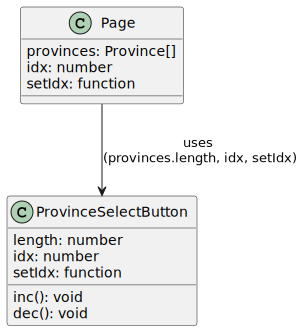

### コンポーネントの導入

今までは全ての機能を`ではinterface`で定義した変数を使うように書き換える．`Page.tsx`に記述していた．次は機能ごとにコンポーネントとして分割する．

コンポーネントとは，部品のようなもの．今までは`Page.tsx`を編集していたが，あれは`Page`コンポーネントだった．コンポーネントの定義は`export default function ...`から始まっていた．これは関数コンポーネントと呼ばれる．

今回分割する機能はボタンでの都道府県選択部分．まずは `ProvinceSelectButton.tsx` を以下の場所に新規作成する．

```
├── src
│   └── app
│       ├── Province.ts
│       ├── conponents
│       │   └── ProvinceSelectButton.tsx ←これ
│       ├── favicon.ico
│       ├── globals.css
│       ├── layout.tsx
│       ├── page.module.css
│       └── page.tsx
```

とりあえず関連部分のコードを切り出して以下のように貼り付ける．

```TypeScript
export default function ProvinceSelectButton() {
    const inc = () => {
        setIdx((idx + 1) % provinces.length);
    };
    const dec = () => {
        setIdx((idx + provinces.length - 1) % provinces.length);
    };


    return (
        <div>
            <button onClick={inc}>+</button>
            <button onClick={dec}>-</button>
        </div>
    );
}
```

ここから，図のように`ProvinceSelectButton`コンポーネントから`Page`コンポーネントに対して`provinces.length`, `idx`, `setIdx`を参照していることが分かる．

これらは，そのままでは`ProvinceSelectButton.tsx`では使うことが出来ない．そこで，`Page.tsx`から渡してもらう．そのために，引数として 3 つの値をもらう．



引数の形式を interface で定義した変数を使うように書き換える． として以下のように定義する．

```TypeScript
interface Props {
    length: number;
    setIdx: (idx: number) => void;
    idx: number;
}
```

初見では`setIdx`がわかりにくい．":"以下の

```TypeScript
(idx: number) => void
```

部分が型．

```TypeScript
(引数) => 戻り値
```

を意味する．
つまり，`setIdx`は引数が`number`, 戻り値を持たない関数であると定義されている．

次はコンポーネントの引数として今定義した interface を使うようにコンポーネントを再定義する．

まず

```TypeScript
{ length, setIdx, idx }
```

でオブジェクトとして 3 つの変数をまとめて書き，その後ろに型名（interface 名）を書く．

```TypeScript
{ length, setIdx, idx }: Props
```

あとは()の中に 型情報を書くだけ．

```TypeScript
export default function ProvinceSelectButton({ length, setIdx, idx }: Props) {
```

また，コンポーネント内で定義される関数`inc`, `dec`では interface で定義した変数を使うように書き換える．`provinces.length` から `length` に簡略化出来た．

```TypeScript
const inc = () => {
    setIdx((idx + 1) % length);
};
const dec = () => {
    setIdx((idx + length - 1) % length);
};
```

`ProvinceSelectButton.tsx`のコード全体は以下のようになる．

```TypeScript
interface Props {
    length: number;
    setIdx: (idx: number) => void;
    idx: number;
}

export default function ProvinceSelectButton({ length, setIdx, idx }: Props) {
    const inc = () => {
        setIdx((idx + 1) % length);
    };
    const dec = () => {
        setIdx((idx + length - 1) % length);
    };

    return (
        <div>
            <button onClick={inc}>+</button>
            <button onClick={dec}>-</button>
        </div>
    );
}

```

次は`Page.tsx`から`ProvinceSelectButton.tsx`を呼び出せるようにする．以下の部分を書き換える．

```TypeScript
<div>
    <p>{provinces[idx].name}</p>
    <p>{data && data.text}</p>
    <button onClick={inc}>+</button>
    <button onClick={dec}>-</button>
</div>
```

書き換えるとこのようになる．2 つのボタンが 1 つのコンポーネントになったかわりに，コンポーネントに引数を与えている．

```TypeScript
<div>
    <p>{provinces[idx].name}</p>
    <p>{data && data.text}</p>
    <ProvinceSelectButton
        length={provinces.length}
        setIdx={setIdx}
        idx={idx}
    />
</div>
```

また，不要になった inc と dec を削除する．

すると`Page.tsx`のコード全体は以下のようになる．

```TypeScript
"use client";

import { useEffect, useState } from "react";
import Province from "./Province";
import ProvinceSelectButton from "./conponents/ProvinceSelectButton";

interface ForcastData {
    publishingOffice: string;
    reportDatetime: string;
    targetArea: string;
    headlineText: string;
    text: string;
}

export default function Home() {
    const provinces: Province[] = [
        new Province("山梨県", "190000"),
        new Province("長野県", "200000"),
        new Province("岐阜県", "210000"),
        new Province("静岡県", "220000"),
        new Province("愛知県", "230000"),
    ];
    const [idx, setIdx] = useState<number>(0);

    const [data, setData] = useState<ForcastData>();

    useEffect(() => {
        const apiUrl = `https://www.jma.go.jp/bosai/forecast/data/overview_forecast/${provinces[idx].code}.json`;
        const fetchData = async () => {
            try {
                const response = await fetch(apiUrl);
                const jsonData = await response.json();
                setData(jsonData);
            } catch (error) {
                console.error("Error fetching data: ", error);
            }
        };

        fetchData();
    }, [idx]);

    return (
        <div>
            <p>{provinces[idx].name}</p>
            <p>{data && data.text}</p>
            <ProvinceSelectButton
                length={provinces.length}
                setIdx={setIdx}
                idx={idx}
            />
        </div>
    );
}

```

##
[実装トップ](https://github.com/Tsuyopon-1067/its-nextjs-practice/blob/main/doc/implement/0_implement.md)

[前へ：2-1. 都道府県データのクラス化](https://github.com/Tsuyopon-1067/its-nextjs-practice/blob/main/doc/implement/2_refactoring/1_class.md)

[次へ：2-3. NowLoading を作ってみる](https://github.com/Tsuyopon-1067/its-nextjs-practice/blob/main/doc/implement/2_refactoring/3_nowLoading.md)